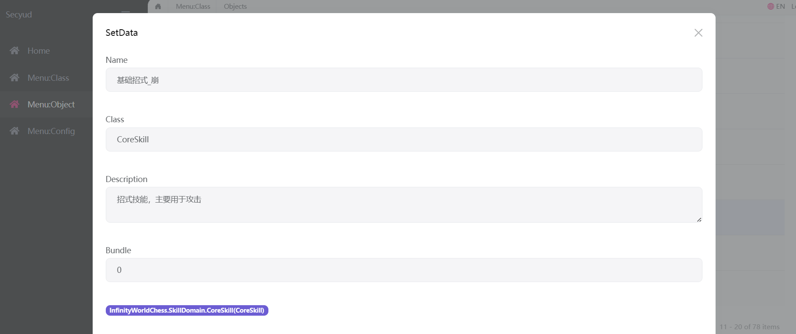
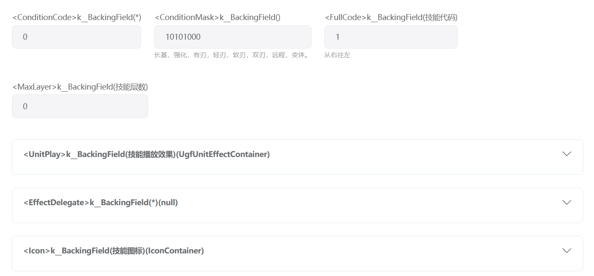
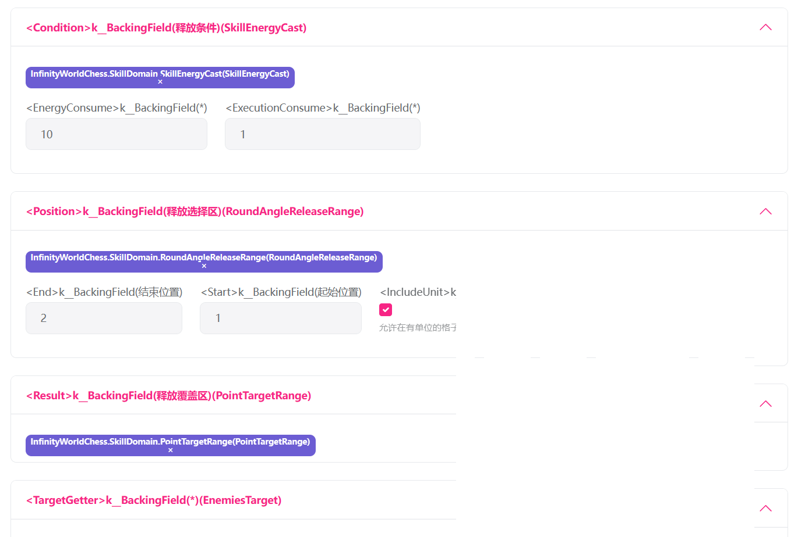
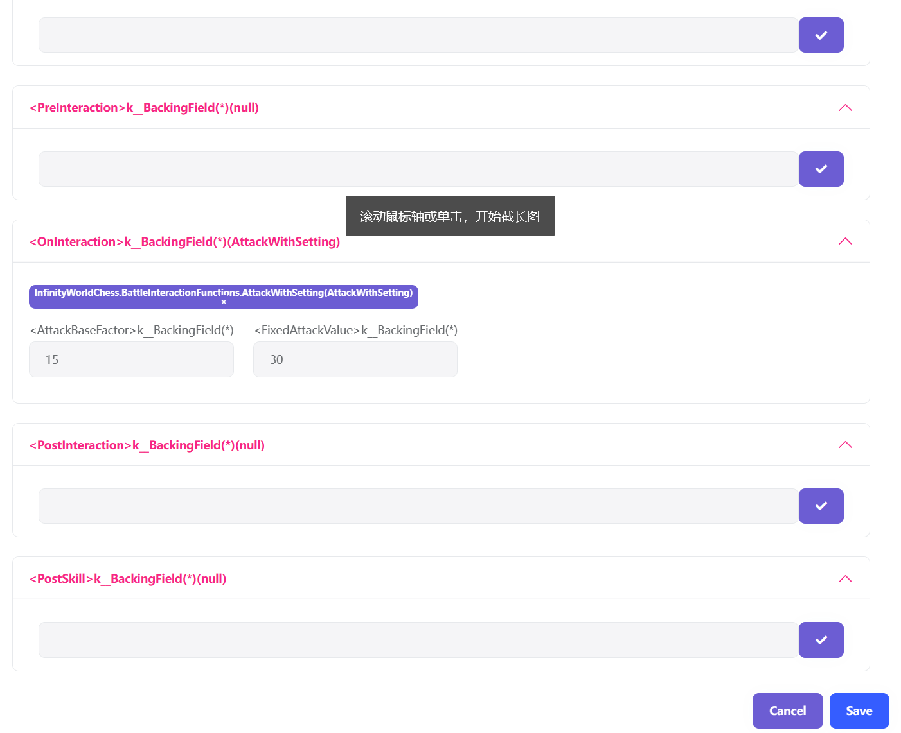
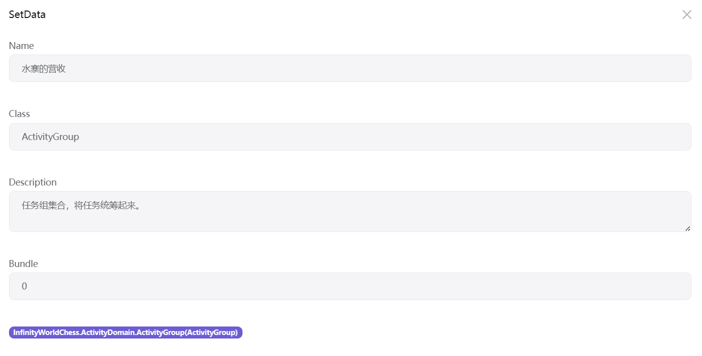
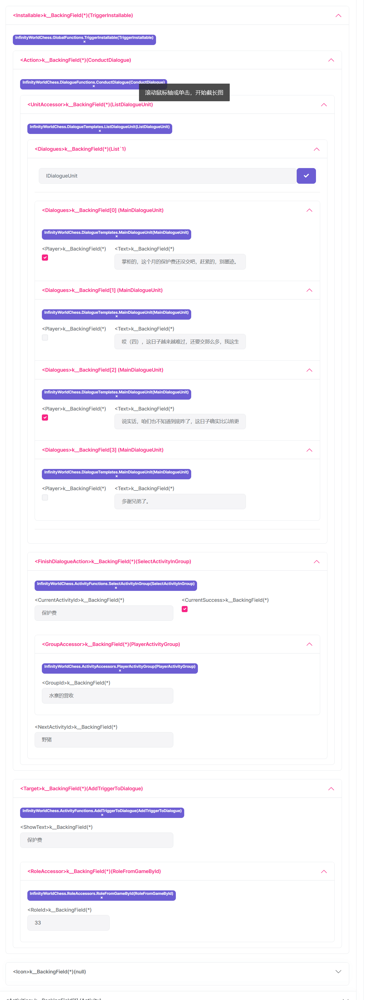

# 招式创建

* 核心招式可以使用附带的类型`CoreSkill`

* 先设置一些基础属性, 其中 条件代码, 条件掩码共同决定了这件武器的特性.
* 如图, 条件代码为 0b00000000, 条件掩码为 0b10101000. 这意味着武器是短基, 无刃且坚硬的. 
> 当然这只是一个设定, 在已有模板上, 符合武学的武器将会造成更多的伤害.
> 如果这个招式无需任何武器条件, 就会直接增加伤害.
* 后面是技能本身的代码, 它决定了技能可以被装备在哪个位置.
> 现在技能最高层数为3, 最低为0. 而代码决定了技能前置及本身需要阴阳位置.

* UnitPlay为释放技能时播放的内容, 在现有模板上只有特效.
* EffectDelegate 可以留空, 留空意味着技能特效会向目标位置进行一个移动.
> 它的作用其实是在技能播放的时候进行一些设定, 要注意 设计这个类的时候一定要在内容中添加TriggerEffect 方法, 否则会卡在战斗中.
* Icon 就是技能的图标.



* 释放条件 就是释放技能的限制, 比如蓝耗, 行动力消耗等等. 内置只有一个蓝耗加行动力消耗.
* 释放选择区 就是释放技能可以点击的区域.
* 释放覆盖区 释放技能的覆盖区域.
* 目标获取 在覆盖区域内会有一些单位, 会获取符合条件的单位.


技能结算流程分为5步.
```
第一步, 技能准备 准备技能的参数 这将在获取目标之前完成 如添加技能交互buff.
{
    第二步, 轮询每个目标时, 为每个目标建立交互, 这时候可以准备交互内容, 如设置攻击, 治疗参数等.
    第三步, 与目标交互 如攻击, 治疗 等
    第四步, 交互后结算, 如吸血 等
}
第五步 结束技能结算, 如移除技能交互buff
```
* 其中 第二到四步会为每个目标发生一次.
* 图中仅仅是一个简单的攻击, 它设定了 攻击的系数和固定值, 然后进行攻击.
* 如果要详细设定攻击参数, 可以在 `PreInteraction` 中加入 `AttackSetting`的内容. 然后在`OnInteraction`中加入`AttackInteraction`.



阵势技能同理，只是不设置层数和代码，而是类型和状态。

# 任务创建
* 任务创建应当使用`ActivityGroup`.

* 这意味着是一个任务链路, 或者说任务组.

* 任务列表看起来有些复杂, 事实上这是为了提供丰富的触发器使用的.
* 一些套路性质的任务完全可以自己写模板完成, 只需填上必要的参数就可以了.
* 其中 `Activity` 本身提供描述性数据. `Installable` 提供并安装任务的触发器.
> 当任务接受时, 触发器会执行`Install` 流程, 从而在游戏世界中安放任务进度所需的内容.
> 同时触发器流程内应当包含结束任务的内容, 这样任务结束时才会调用`UnInstall`回收触发器.

* 一个简单的安装器 它在角色对话的地方安装了一个对话剧情, 只要完成对话就可以结束任务.
* 看起来很复杂, 这是因为使用的是通用数据模型编辑器, 其实根据具体情况, 完全可以简化编辑流程.

